**Copyright © 2026 Amirsam Azmoodeh. All Rights Reserved.**

# 🚀 Crypto-Journey-From-Zero-to-Something-Cool

> **A 26-Step Educational Journey from Basic XOR to Cuckoo Filters**

[](https://python.org)
[](https://www.apache.org/licenses/LICENSE-2.0)
[](https://github.com/yourusername/crypto-journey)
[](https://github.com/yourusername/crypto-journey/pulls)
[](https://github.com/yourusername/crypto-journey/releases)
[](https://github.com/psf/black)
[](https://github.com/yourusername/crypto-journey/actions)

---

## 📖 Table of Contents

- [✨ Why This Project?](#-why-this-project)
- [🚀 Features](#-features)
- [🛠️ Technologies](#️-technologies)
- [📦 Installation](#-installation)
- [⚡ Quick Start](#-quick-start)
- [🧪 Evolution Timeline](#-evolution-timeline)
- [📚 Usage Examples](#-usage-examples)
- [🗂️ Project Structure](#️-project-structure)
- [🧪 Testing](#-testing)
- [🤝 Contributing](#-contributing)
- [📄 License](#-license)
- [📬 Contact](#-contact)

---

## ✨ Why This Project?

**From "What's a hash?" to "Let's implement a Cuckoo Filter"** - this is my 26-step journey of learning cryptography by actually building it.

### 🎯 **The Mission**
Ever wondered how encryption *really* works under the hood? I took the "learn by doing" approach to heart and built 26 versions of a cryptographic system - starting with the most broken, insecure code imaginable (`try_1.py` - just multiplying ASCII values 😅) and evolving all the way to a system with:
- ✅ **Cuckoo Filters** for replay protection
- ✅ **Blake2b** for keystream generation
- ✅ **HMAC** for authentication
- ✅ **PBKDF2** for key derivation
- ✅ **Nonce processing** for better diffusion

### ⚠️ **IMPORTANT DISCLAIMER**
> This is an **educational project** created for learning purposes. These implementations are **NOT SECURE** for production use. Always use well-audited libraries like `cryptography` or `libsodium` in real applications!

---

## 🚀 Features

### 🔬 **26 Evolutionary Versions**
Each version builds upon the previous, fixing vulnerabilities and adding new concepts.

| Version Range | Concept | Security Level |
|---------------|---------|----------------|
| **v1-6** | Basic operations (sum, multiplication, XOR) | 🔴 VERY LOW |
| **v7-10** | Key derivation (PBKDF2) + HMAC Authentication | 🟡 LOW |
| **v11-18** | Advanced KDF + Class-based architecture | 🟡 MEDIUM |
| **v19-21** | Replay protection (set → bitmap) | 🟡 MEDIUM-HIGH |
| **v22-24** | Enhanced keystream + Auto-reset bitmap | 🟢 MEDIUM-HIGH |
| **v25-26** | Cuckoo Filter + Blake2b 🏆 | 🟢 HIGH |

### 🛡️ **Security Evolution**
- ❌ No authentication → ✅ HMAC verification
- ❌ No replay protection → ✅ Cuckoo filter with ~0.01% false positives
- ❌ Simple key → ✅ PBKDF2 + HKDF derivation
- ❌ Basic XOR → ✅ Blake2b stream cipher

### 📊 **Memory vs. Security Trade-offs**
| Method | Memory Usage | False Positives | Accuracy |
|--------|--------------|-----------------|----------|
| **Set (v19)** | ~8 MB for 100k entries | 0% | ✅ 100% |
| **Bitmap (v21)** | ~8 KB for 65k bits | ~0.001% | ⚠️ 99.999% |
| **Cuckoo Filter (v26)** | ~16 KB for 4 segments | ~0.01% | ✅ 99.99% |

---

## 🛠️ Technologies

| Technology | Purpose | Version Used |
|------------|---------|--------------|
|  | Core Language | 3.8+ |
|  | Cryptographic Hashing | Built-in |
|  | Message Authentication | Built-in |
|  | Key Derivation | Built-in |
|  | Bitmap Storage | bitarray |
|  | Approximate Set | Custom Implementation |

---

## 📦 Installation

### Prerequisites
- Python 3.8 or higher
- pip package manager

### Step 1: Clone the Repository
```bash
$ git clone https://github.com/yourusername/crypto-journey.git
$ cd crypto-journey
```

### Step 2: Create Virtual Environment (Recommended)
```bash
$ python -m venv venv
$ source venv/bin/activate  # On Windows: venv\Scripts\activate
```

### Step 3: Install Dependencies
```bash
$ pip install -r requirements.txt
```

### Step 4: Run the Examples
```bash
$ python examples/usage_example.py
```

---

## ⚡ Quick Start

```python
# Import the most advanced version (try_26)
from src.try_26 import ASA_Crypt

# Initialize with your secret key
crypt = ASA_Crypt(
    key=b'my-secret-key-123',
    cuckoo_enabled=True,
    cuckoo_num_segments=4,
    cuckoo_bucket_count=256,
    cuckoo_fingerprint_bits=12
)

# Encrypt a message
plaintext = "Hello, World! This is a secure message."
encrypted = crypt.encrypt(plaintext)
print(f"🔒 Encrypted: {encrypted}")

# Decrypt the message
decrypted = crypt.decrypt(encrypted)
print(f"🔓 Decrypted: {decrypted}")
# Output: Hello, World! This is a secure message.

# Replay protection in action
# The same message cannot be decrypted twice!
second_attempt = crypt.decrypt(encrypted)
print(f"🛡️ Replay attempt: {second_attempt}")
# Output: None (replay detected by cuckoo filter)
```

### 🎯 Compare Different Versions
```python
# See how each version handles the same data
from src.try_1 import encrypt as encrypt_v1
from src.try_10 import encrypt as encrypt_v10
from src.try_26 import ASA_Crypt

key = b'test_key'
data = "sensitive data"

# Version 1: Very basic (insecure)
enc1 = encrypt_v1(data, key)

# Version 10: Added authentication
enc10 = encrypt_v10(data, key)

# Version 26: Most advanced with cuckoo filter
crypt26 = ASA_Crypt(key)
enc26 = crypt26.encrypt(data)
```

---

## 🧪 Evolution Timeline

### 📊 **Version Comparison Matrix**

| Feature | v1 | v5 | v10 | v15 | v19 | v21 | v23 | v25 | v26 |
|---------|----|----|-----|-----|-----|-----|-----|-----|-----|
| **Basic Encryption** | ✅ | ✅ | ✅ | ✅ | ✅ | ✅ | ✅ | ✅ | ✅ |
| **Key Derivation** | ❌ | ❌ | ✅ | ✅ | ✅ | ✅ | ✅ | ✅ | ✅ |
| **Authentication** | ❌ | ❌ | ✅ | ✅ | ✅ | ✅ | ✅ | ✅ | ✅ |
| **Replay Protection** | ❌ | ❌ | ❌ | ❌ | ✅ | ✅ | ✅ | ✅ | ✅ |
| **Memory Efficient** | ✅ | ✅ | ✅ | ✅ | ❌ | ✅ | ✅ | ✅ | ✅ |
| **False Positives** | ❌ | ❌ | ❌ | ❌ | ❌ | ⚠️ | ⚠️ | ⚠️ | ✅ |
| **Auto-Reset** | ❌ | ❌ | ❌ | ❌ | ❌ | ❌ | ✅ | ✅ | ✅ |
| **Cuckoo Filter** | ❌ | ❌ | ❌ | ❌ | ❌ | ❌ | ❌ | ✅ | ✅ |
| **Blake2b Keystream** | ❌ | ❌ | ❌ | ❌ | ❌ | ❌ | ❌ | ❌ | ✅ |

### 📈 **Security Evolution**

```mermaid
graph LR
    A[try_1: Basic Sum] --> B[try_6: XOR+Compression]
    B --> C[try_10: HMAC Auth]
    C --> D[try_19: Set Replay]
    D --> E[try_21: Bitmap]
    E --> F[try_23: Auto-Reset]
    F --> G[try_25: Cuckoo Filter]
    G --> H[try_26: Blake2b + Cuckoo]
    
    style A fill:#ff6b6b
    style B fill:#ff6b6b
    style C fill:#ffd93d
    style D fill:#ffd93d
    style E fill:#6bcb77
    style F fill:#6bcb77
    style G fill:#4d96ff
    style H fill:#4d96ff
```



---

## 📚 Usage Examples

### 🔑 **Basic Encryption/Decryption**
```python
from src.try_26 import ASA_Crypt

# Initialize with default settings
crypt = ASA_Crypt(b'my-key')

# Encrypt
encrypted = crypt.encrypt("Secret message")

# Decrypt
decrypted = crypt.decrypt(encrypted)
assert decrypted == "Secret message"
```

### 🔄 **Customize Cuckoo Filter**
```python
crypt = ASA_Crypt(
    key=b'my-secret-key',
    cuckoo_enabled=True,
    cuckoo_num_segments=8,       # More segments = more memory, better accuracy
    cuckoo_bucket_count=512,     # More buckets = lower false positive
    cuckoo_fingerprint_bits=16,  # More bits = fewer collisions
    cuckoo_buckets_per_tag=2,    # Number of buckets per tag
    cuckoo_kicking_attempts=100  # Max kicks during insertion
)

# Monitor filter stats
print(f"Total checks: {crypt.cuckoo_total_checks}")
print(f"Replays detected: {crypt.cuckoo_detected}")
```

### 🧪 **Test Replay Protection**
```python
from src.try_19 import ASA_Crypt as SetCrypt
from src.try_21 import ASA_Crypt as BitmapCrypt
from src.try_26 import ASA_Crypt as CuckooCrypt

key = b'test'

# Set-based (100% accurate, memory heavy)
set_crypt = SetCrypt(key)
msg = set_crypt.encrypt("test")
print(set_crypt.decrypt(msg))  # Works first time
print(set_crypt.decrypt(msg))  # None (replay detected)

# Bitmap-based (memory efficient, false positives)
bitmap_crypt = BitmapCrypt(key)
msg = bitmap_crypt.encrypt("test")
print(bitmap_crypt.decrypt(msg))  # Works first time
print(bitmap_crypt.decrypt(msg))  # May return None

# Cuckoo-based (balanced, very low false positives)
cuckoo_crypt = CuckooCrypt(key)
msg = cuckoo_crypt.encrypt("test")
print(cuckoo_crypt.decrypt(msg))  # Works first time
print(cuckoo_crypt.decrypt(msg))  # None (replay detected)
```

### 📊 **Monitor Replay Protection Statistics**
```python
crypt = ASA_Crypt(b'key')

# Simulate many messages
for i in range(1000):
    msg = crypt.encrypt(f"Message {i}")
    crypt.decrypt(msg)
    
    # Try to replay (should fail)
    crypt.decrypt(msg)

print(f"Total checks: {crypt.cuckoo_total_checks}")
print(f"Replays detected: {crypt.cuckoo_detected}")
print(f"False positive rate: {(crypt.cuckoo_detected / crypt.cuckoo_total_checks) * 100:.2f}%")
```

### 🔧 **Advanced Configuration**
```python
# High security configuration
crypt_high = ASA_Crypt(
    key=b'strong-secret-key',
    salt_size=32,              # Larger salt
    nonce_size=24,             # Larger nonce
    hmac_size=32,              # Full HMAC
    block_size=64,             # Larger block
    cuckoo_num_segments=8,
    cuckoo_bucket_count=1024,
    cuckoo_fingerprint_bits=16
)

# Memory-optimized configuration
crypt_low = ASA_Crypt(
    key=b'key',
    salt_size=12,              # Smaller salt
    nonce_size=12,             # Smaller nonce
    hmac_size=12,              # Truncated HMAC
    block_size=32,             # Smaller block
    cuckoo_num_segments=2,
    cuckoo_bucket_count=128,
    cuckoo_fingerprint_bits=8
)
```

---

## 🗂️ Project Structure

```
crypto-journey/
├── 📁 src/                          # All 26 versions
│   ├── 📄 try_1.py                 # Basic sum encryption
│   ├── 📄 try_2.py                 # Sequential multiplication
│   ├── 📄 try_3.py                 # SHA256 + multiplication
│   ├── 📄 try_4.py                 # Basic XOR
│   ├── 📄 try_5.py                 # Optimized XOR
│   ├── 📄 try_6.py                 # XOR + compression
│   ├── 📄 try_7.py                 # XOR + Salt + PBKDF2
│   ├── 📄 try_8.py                 # Added nonce
│   ├── 📄 try_9.py                 # Stream cipher with counter
│   ├── 📄 try_10.py                # Header + HMAC auth
│   ├── 📄 try_11.py                # PBKDF2 + Soft State
│   ├── 📄 try_12.py                # Hashed header
│   ├── 📄 try_13.py                # Improved KDF
│   ├── 📄 try_14.py                # Class-based architecture
│   ├── 📄 try_15.py                # HKDF + Blake2s
│   ├── 📄 try_16.py                # Fusion + Rotation
│   ├── 📄 try_17.py                # Improved rotation
│   ├── 📄 try_18.py                # Set-based (buggy)
│   ├── 📄 try_19.py                # Set-based (fixed)
│   ├── 📄 try_20.py                # Limited set
│   ├── 📄 try_21.py                # Bitmap-based
│   ├── 📄 try_22.py                # Enhanced bitmap
│   ├── 📄 try_23.py                # Auto-reset bitmap
│   ├── 📄 try_24.py                # Enhanced keystream
│   ├── 📄 try_25.py                # Cuckoo filter 🏆
│   └── 📄 try_26.py                # Cuckoo + Blake2b 🏆
│
├── 📁 examples/                     # Usage examples
│   ├── 📄 usage_example.py
│   ├── 📄 benchmark.py
│   └── 📄 compare_versions.py
│
├── 📁 tests/                        # Unit tests
│   ├── 📄 test_try_26.py
│   ├── 📄 test_cuckoo.py
│   ├── 📄 test_vectors.py
│   └── 📄 test_replay.py
│
├── 📁 docs/                         # Documentation
│   ├── 📄 evolution.md             # Detailed version history
│   ├── 📄 security_analysis.md     # Security analysis
│   ├── 📄 cuckoo_filter.md         # Cuckoo filter explanation
│   └── 📄 api_reference.md         # API documentation
│
├── 📄 README.md                    # This file
├── 📄 LICENSE                      # Apache 2.0 License
├── 📄 requirements.txt             # Dependencies
├── 📄 setup.py                     # Package setup
└── 📄 .gitignore
```

---

## 🧪 Testing

### Run All Tests
```bash
$ pytest tests/
```

### Run Specific Test
```bash
$ pytest tests/test_try_26.py
$ pytest tests/test_cuckoo.py
```

### Test Coverage
```bash
$ pytest --cov=src tests/
```

### 🧪 Performance Benchmark
```bash
$ python examples/benchmark.py
```

Sample output:
```
🔬 Crypto Journey Performance Benchmark
========================================
Version 1: 0.0001s per operation (1000 ops)
Version 10: 0.0005s per operation (1000 ops)
Version 21: 0.0012s per operation (1000 ops)
Version 26: 0.0015s per operation (1000 ops)

📊 Memory Usage Comparison:
- Set-based (v19): 8.2 MB for 100k entries
- Bitmap (v21): 8.2 KB for 65k bits
- Cuckoo Filter (v26): 16.4 KB for 4 segments

📈 False Positive Rates:
- Set (v19): 0%
- Bitmap (v21): ~0.001% (theoretical)
- Cuckoo Filter (v26): ~0.01% (theoretical)
```

---

## 🤝 Contributing

I ❤️ contributions! Here's how you can help:

### 📋 Ways to Contribute
- 🐛 **Report bugs** - Open an issue with reproduction steps
- 💡 **Suggest features** - I'm open to ideas
- 📝 **Improve documentation** - Fix typos, add examples
- 🔧 **Submit PRs** - Fix issues or add features
- 🎓 **Share learnings** - Write about your experience

### 🚀 Development Process
1. **Fork** the repository
2. **Create a branch**: `git checkout -b feature/amazing-feature`
3. **Commit changes**: `git commit -m 'Add amazing feature'`
4. **Push**: `git push origin feature/amazing-feature`
5. **Open a Pull Request**

### 📝 Coding Standards
- Follow [PEP 8](https://pep8.org/)
- Use type hints for all functions
- Write docstrings (Google style)
- Add tests for new features
- Keep the evolution narrative consistent

### 🎯 Pull Request Checklist
- [ ] Code follows style guidelines
- [ ] Tests pass locally
- [ ] Documentation updated
- [ ] No breaking changes without notice
- [ ] Commit messages are clear

---

## 📄 License

Copyright 2024 Amirsam Azmoodeh

Licensed under the Apache License, Version 2.0 (the "License");
you may not use this file except in compliance with the License.
You may obtain a copy of the License at:

```
http://www.apache.org/licenses/LICENSE-2.0
```

Unless required by applicable law or agreed to in writing, software
distributed under the License is distributed on an "AS IS" BASIS,
WITHOUT WARRANTIES OR CONDITIONS OF ANY KIND, either express or implied.
See the License for the specific language governing permissions and
limitations under the License.

See the [LICENSE](LICENSE) file for full text.

### 📝 License Summary
| Use Case | Permitted |
|----------|-----------|
| ✅ Personal/Educational Use | Yes |
| ✅ Commercial Use | Yes |
| ✅ Modify Source Code | Yes |
| ✅ Distribute | Yes |
| ✅ Sublicense | Yes |
| ✅ Use in Proprietary Projects | Yes |
| ❌ Liability | No |
| ❌ Warranty | No |
| ⚠️ Must include copyright notice | Yes |
| ⚠️ Must include license text | Yes |

---

## 📬 Contact

**Amirsam Azmoodeh**

[](mailto:amirsamazmoodeh@gmail.com)
[](https://linkedin.com/in/amirsam-azmoodeh)
[](https://github.com/yourusername)

---

## 🙏 Acknowledgments

- **Ehsan Bakhtiari** - For bitmap implementation support and collaboration
- Thanks to the Python cryptography community
- Built with ❤️ for learning and teaching

---

## 📚 Further Reading

### Cryptography Fundamentals
- [Cryptography Engineering](https://www.schneier.com/books/cryptography_engineering/) - By Ferguson, Schneier, Kohno
- [Applied Cryptography](https://www.schneier.com/books/applied_cryptography/) - By Bruce Schneier
- [OWASP Cryptographic Storage Cheat Sheet](https://cheatsheetseries.owasp.org/cheatsheets/Cryptographic_Storage_Cheat_Sheet.html)

### Python Libraries
- [Python Cryptography Toolkit](https://www.pycryptodome.org/)
- [cryptography.io](https://cryptography.io/) - Modern Python cryptography
- [Libsodium Documentation](https://doc.libsodium.org/)

### Research Papers
- [Cuckoo Filters: Practically Better Than Bloom](https://www.cs.cmu.edu/~dga/papers/cuckoo-conext2014.pdf)
- [The Blake2 Hash Function](https://www.blake2.net/)

---

## 🌟 Show Your Support

If you found this project helpful or interesting, please give it a ⭐ on GitHub!

[](https://github.com/yourusername/crypto-journey/stargazers)

---

## 📊 Project Statistics

| Metric | Value |
|--------|-------|
| Lines of Code | 3500+ |
| Versions | 26 |
| Contributors | 2 |
| Test Coverage | 85%+ |
| Days of Learning | 30+ |

---

## 🏆 Version Hall of Fame

| Version | Achievement | Why It Matters |
|---------|-------------|----------------|
| **try_1** | 🏁 The Beginning | Where it all started |
| **try_10** | 🔐 Authentication | Added HMAC for integrity |
| **try_19** | 🛡️ Replay Protection | First working replay protection |
| **try_21** | ⚡ Memory Efficiency | Switched to bitmap (1000x memory reduction) |
| **try_25** | 🎯 Cuckoo Filter | State-of-the-art replay protection |
| **try_26** | 🏆 The Final Form | Blake2b + Cuckoo = Best of both worlds |

---

**Made with ❤️ and ☕ by Amirsam Azmoodeh**

*"The best way to learn cryptography is to build it, break it, and build it again - but never use your creation in production!"* 🛡️
